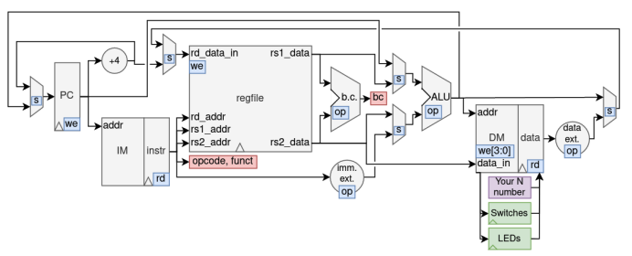

<h1 align="center">NYU-6463-RV32I-Processor-Design-Project</h1>

  

    The NYU-6463-RV32I processor is a 32-bit architecture which executes a subset of the open source RISC-V RV32I
instruction set.
     
    <a href="https://github.com/ZhuoXu-CSE/NYU-6463-RV32I-Processor-Design-Project"><strong>Explore the project »</strong></a>
     
  

## About The Project

 
The NYU-6463-RV32I processor is a 32-bit architecture which executes a subset of the open source RISC-V RV32I
instruction set. There are three main instruction types: (a) computational operations (from register file to register
file), (b) load/store between memory and register file, and (c) control flow (jumps and branches to different parts of
code).

(<a href="#top">back to top</a>)

### Built With

* VHDL
* Xilinx Vivado

(<a href="#top">back to top</a>)

